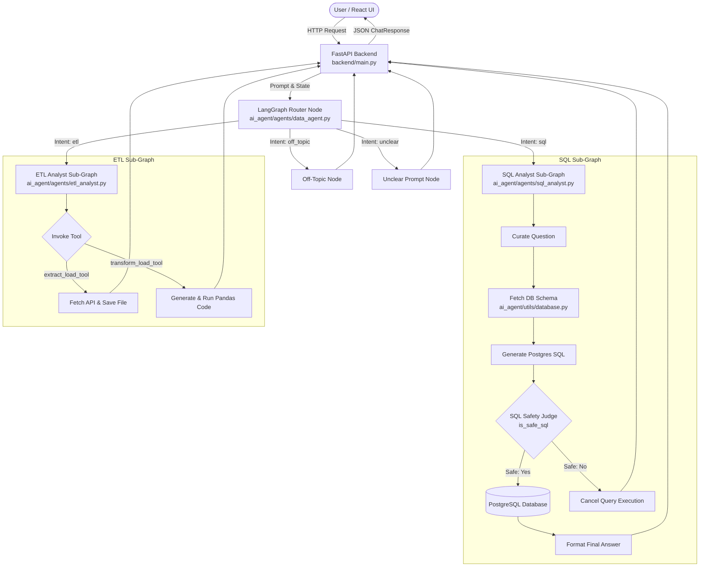

# QueryFlow

> Ask. Analyze. Transform.

QueryFlow is a natural language analytics workspace and multi-agent system built on **LangGraph**, **FastAPI**, **React 19**, and **PostgreSQL**. It allows non-technical users and data teams to explore database tables, run automated SQL queries, perform ETL data transformations, and visualize insights without writing code.

---

## Key Features

- **Natural Language Data Querying**: Convert natural language questions into database-ready PostgreSQL queries.
- **Multi-Agent Orchestration**: Built with a stateful LangGraph router (`data_agent.py`) that classifies intent into dedicated downstream agent graphs (`sql_analyst.py` and `etl_analyst.py`), off-topic handlers, or clarification prompts.
- **SQL Safety & Validation**: Evaluates generated SQL queries using an AI Judge node (`is_safe_sql`) to block destructive mutations (`INSERT`, `UPDATE`, `DELETE`, `DROP`, `ALTER`, `TRUNCATE`, `CREATE`).
- **CSV Dataset Ingestion & Table Management**: Upload CSV files directly via API or UI to dynamically create sanitized PostgreSQL tables, map data types, and load records.
- **Automated ETL Pipeline**: Extract data from REST APIs or perform Pandas transformation scripts using dedicated agent tools (`extract_load_tool` and `transform_load_tool`).
- **Interactive Web Dashboard**: Modern React 19 interface with interactive dataset views, SQL code blocks, Recharts data visualizations, and query history audit logs.
- **Context-Aware Follow-up Processing**: Resolves conversational references and maintains short-term history across chat turns.

---

## Architecture & System Flow



---

## How It Works

1. **User Request**: The user submits a prompt via the React web UI or API endpoint (`/api/chat`), optionally selecting an active dataset.
2. **Intent Classification**: The request passes to the LangGraph router (`router_node`), which classifies the query as `sql`, `etl`, `off_topic`, or `unclear`.
3. **Agent Dispatch**:
   - **SQL Queries**: Dispatched to the `sql_analyst` sub-graph. The agent inspects database schema context via `DatabaseUtil`, generates a read-only PostgreSQL query, validates safety through `is_safe_sql`, executes the query against PostgreSQL, and formats a human-readable response.
   - **ETL Tasks**: Dispatched to the `etl_analyst` sub-graph. The agent invokes `extract_load_tool` or `transform_load_tool` to perform API fetches or run sandboxed Pandas operations.
   - **Off-Topic / Unclear**: Handled gracefully without executing database queries or code.
4. **Result Delivery**: Results, executed SQL, schema columns, data rows, and formatting metadata are returned to the React frontend.

---

## Multi-Agent & AI Infrastructure

- **LangGraph Orchestration**: The main system (`data_agent.py`) compiles a `StateGraph` containing state router nodes, conditional edges, and compiled sub-graphs for SQL (`sql_analyst.py`) and ETL (`etl_analyst.py`).
- **LLM Provider Integration**: Configured via `pick_llm` in `ai_agent/utils/llm_pick.py`. Supports Google Generative AI (`GEMINI_API_KEY`) or Groq (`GROQ_API_KEY`) with deterministic zero-temperature outputs.
- **SQL Safety Engine**: Evaluates SQL queries against a Pydantic `JudgeSchema` to enforce read-only execution rules.

---

## Data & Database Layer

- **PostgreSQL Connection**: Managed via `psycopg2` in `ai_agent/utils/database.py`.
- **Schema Context Ingestion**: Dynamically fetches schema details (`table_name`, `column_name`, `data_type`, and 3 sample rows) for prompt context construction.
- **Dataset Manager**: `DatasetManager` (`ai_agent/utils/dataset_manager.py`) handles CSV upload validation, column name sanitization, PostgreSQL data type mapping, table creation, batch row insertion (`execute_values`), and dataset deletion.

---

## Backend API Specification

FastAPI application located at `backend/main.py`.

| Endpoint | Method | Description |
| :--- | :--- | :--- |
| `/api/health` | `GET` | Returns API health status, database connection state, and target database name. |
| `/api/datasets` | `GET` | Returns list of currently loaded in-memory and uploaded datasets. |
| `/api/datasets/upload` | `POST` | Accepts a `.csv` file upload, sanitizes headers, creates a PostgreSQL table, and loads dataset records. |
| `/api/datasets/{dataset_id}` | `GET` | Retrieves details and preview metadata for a specific dataset ID. |
| `/api/datasets/{dataset_id}` | `DELETE` | Drops the dataset table from PostgreSQL and removes it from dataset registry. |
| `/api/query-history` | `GET` | Returns execution audit history for previous dataset queries. |
| `/api/chat` | `POST` | Primary chat completion endpoint invoking the multi-agent graph. |

### Sample Chat Request Payload (`POST /api/chat`)

```json
{
  "message": "Show me the top 5 users by total payments",
  "dataset_id": "uploaded_sales_a1b2c3",
  "history": [
    {"role": "user", "content": "How many records are in the dataset?"}
  ]
}
```

### Sample Chat Response Payload

```json
{
  "intent": "dataset",
  "answer": "The top 5 users with the highest payment amounts are listed in the results below.",
  "route": "sql",
  "sql": "SELECT user_name, SUM(amount) AS total_paid FROM uploaded_sales_a1b2c3 GROUP BY user_name ORDER BY total_paid DESC LIMIT 5;",
  "columns": ["col_1", "col_2"],
  "rows": [
    ["Alice Smith", 450.5],
    ["Bob Johnson", 380.0]
  ],
  "row_count": 2,
  "execution_status": "executed"
}
```

---

## Frontend Workspace

The frontend is built with **React 19**, **Vite**, **TypeScript**, and **Tailwind CSS**, providing four primary application views:

1. **Overview Dashboard** (`OverviewView.tsx`): Displays workspace health, total connected datasets, query volume metrics, and recent activity log.
2. **Ask Data Hub** (`AskDataView.tsx`): Natural language chat interface featuring auto-executing queries, syntax-highlighted SQL blocks (`SqlBlock.tsx`), interactive dynamic charts (`SmartChart.tsx` using Recharts), and tabular query result cards.
3. **Datasets Hub** (`DatasetsView.tsx`): Dataset connection manager to inspect schemas, view table row counts, and upload new CSV files.
4. **Query History Audit** (`QueryHistoryView.tsx`): Full audit log showing historical queries, dataset targets, executed SQL statements, and row output counts.

---

## Tech Stack

- **Frontend**: React 19, TypeScript, Vite, Tailwind CSS, Recharts, PrismJS, Lucide React
- **Backend API**: FastAPI, Uvicorn, Pydantic v2, Python-dotenv
- **AI & Agent Orchestration**: LangGraph, LangChain Core, LangChain Google Generative AI / Groq
- **Database & Data Processing**: PostgreSQL, Psycopg2-binary, Pandas, PyArrow

---

## Repository Structure

```
QueryFlow/
├── ai_agent/                        # Core AI and Agent implementation
│   ├── agents/                      # LangGraph agent definitions
│   │   ├── data_agent.py            # Main router agent state graph
│   │   ├── sql_analyst.py           # SQL generation, safety & execution sub-graph
│   │   └── etl_analyst.py           # ETL tool binding & execution sub-graph
│   ├── models/                      # Pydantic state schemas
│   │   └── schema.py                # Router, SQL Agent, and ETL state schemas
│   └── utils/                       # Core engine utilities
│       ├── database.py              # PostgreSQL database utilities
│       ├── dataset_manager.py       # CSV upload & table management
│       ├── etl_tools.py             # API extraction & Pandas code execution
│       └── llm_pick.py              # LLM provider configuration
├── backend/                         # FastAPI backend application
│   └── main.py                      # REST endpoints and app initialization
├── frontend/                        # React 19 frontend workspace
│   ├── src/                         # Application source code
│   │   ├── components/              # UI components (AskDataView, SmartChart, etc.)
│   │   ├── services/                # API client connection module (apiClient.ts)
│   │   ├── types/                   # TypeScript interfaces (api.ts)
│   │   └── App.tsx                  # Main application container
│   ├── package.json                 # Frontend dependencies and scripts
│   └── vite.config.ts               # Vite configuration
├── data/                            # Sample CSV files and data storage
├── feed_db.py                       # PostgreSQL table creation and seeding script
├── app.py                           # Legacy Streamlit alternative dashboard
├── main.py                          # Terminal CLI invocation test script
├── pyproject.toml                   # Python project configuration
├── requirements.txt                 # Backend Python dependencies
└── README.md                        # Project documentation
```

---

## Installation & Setup

### Prerequisites

- **Python**: Version 3.12 or higher
- **Node.js**: Version 18 or higher
- **PostgreSQL**: Local or remote instance running

### 1. Backend & Agent Environment Setup

```bash
# Clone the repository
git clone https://github.com/Ifrah27/QueryFlow.git
cd QueryFlow

# Create and activate Python virtual environment
python -m venv .venv

# On Windows (PowerShell):
.\.venv\Scripts\Activate.ps1
# On Linux / macOS:
source .venv/bin/activate

# Install Python dependencies
pip install -r requirements.txt
```

### 2. Environment Configuration

Create a `.env` file in the root directory:

```env
# LLM Provider Configuration (At least one required)
GEMINI_API_KEY=your_gemini_api_key_here
# GROQ_API_KEY=your_groq_api_key_here

# PostgreSQL Database Credentials
host=localhost
port=5432
user=postgres
password=your_postgres_password
database=project_sql_agent
```

### 3. Database Initialization

Seed PostgreSQL with standard relational tables (`users`, `vehicles`, `rides`, `payments`, `ratings`):

```bash
python feed_db.py
```

### 4. Frontend Setup

```bash
cd frontend
npm install
```

---

## Running the Application

### Launch FastAPI Backend Server

From the root directory with your virtual environment active:

```bash
python backend/main.py
```
*Backend server starts at `http://localhost:8000`.*

### Launch React Analytics Dashboard

In a separate terminal window:

```bash
cd frontend
npm run dev
```
*Frontend dev server starts at `http://localhost:5173`.*

---

## Example Queries

### SQL Queries (Natural Language Database Exploration)
- *"How many total users are in our database?"*
- *"Show me the top 5 users with the highest total payments."*
- *"What is the average ride rating per vehicle type?"*
- *"Which payment method is used most frequently?"*

### ETL Operations (Extraction & Transformation)
- *"Extract data from 'https://pokeapi.co/api/v2/pokemon' and save it to data/extract in CSV format."*
- *"Transform data/extract/extracted_data.csv to filter bulbasaur pokemon and save to data/transform."*

---

## Security & Safety Guardrails

QueryFlow includes explicit SQL safety enforcement before executing queries against PostgreSQL:

- **AI Judge Validation (`is_safe_sql`)**: All generated SQL statements are evaluated by an AI Judge against strict safety criteria.
- **Enforced Read-Only Intent**: Queries containing database mutation commands (`INSERT`, `UPDATE`, `DELETE`, `DROP`, `ALTER`, `TRUNCATE`, `CREATE`) are classified as unsafe (`is_safe = "No"`).
- **Execution Safeguard**: Unsafe queries bypass execution (`canceled_sql` node) and return a security explanation to the user instead of executing against the database.
- **Output Limit Safeguard**: Unless specifically overridden by the user query, generated queries automatically append `LIMIT 10` to prevent memory overload.

---

## License

This project is licensed under the **MIT License**.
