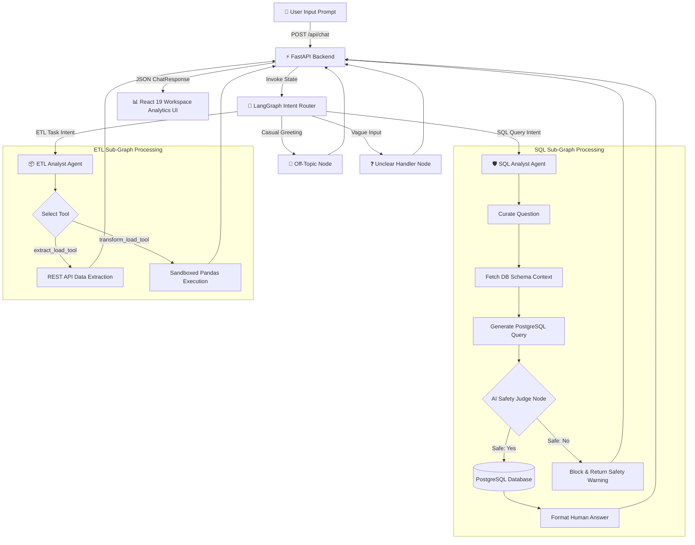
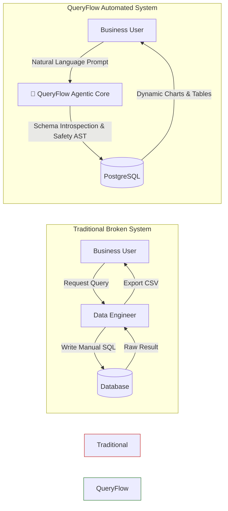
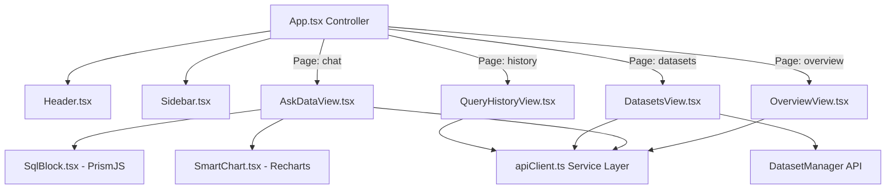
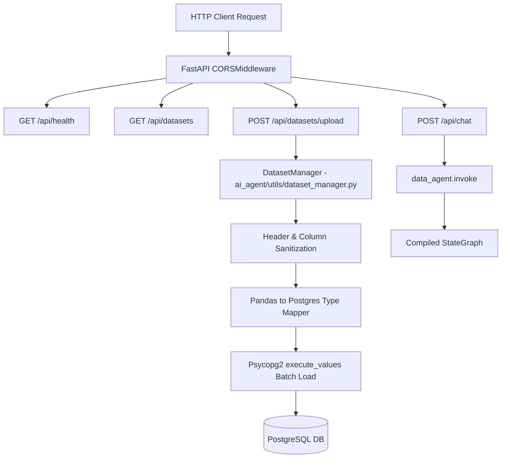
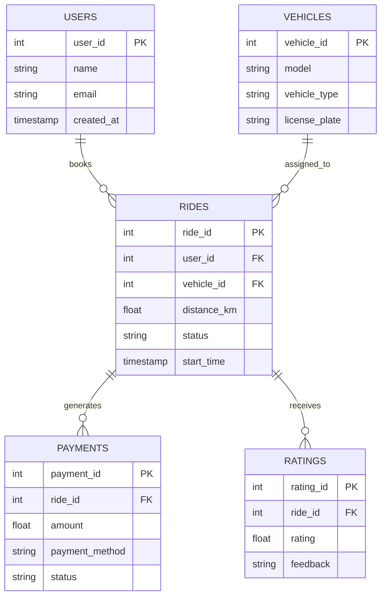
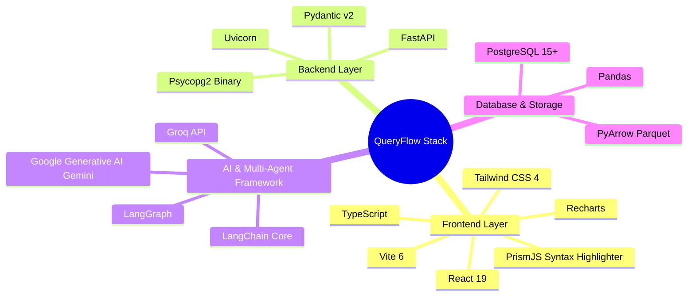
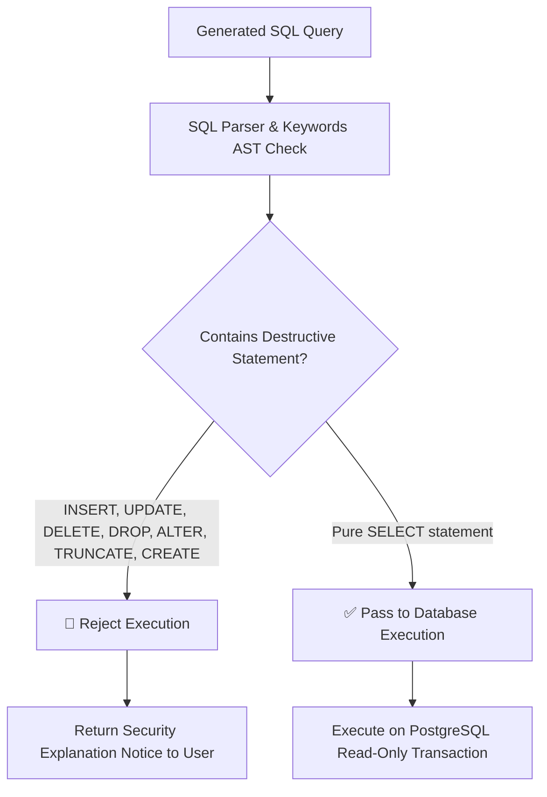
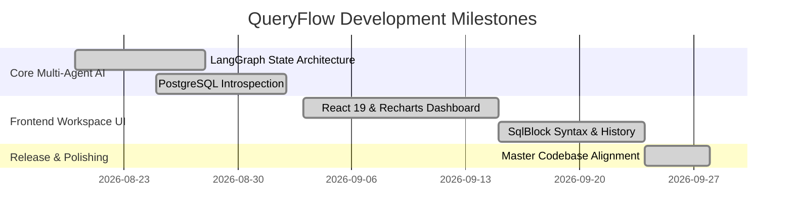

<div align="center">

  

  <h1>QueryFlow</h1>

  <p><strong>Autonomous Multi-Agent AI System for Natural Language Database Analytics & Automated ETL Workflows</strong></p>

  <p>
    <a href="https://github.com/Ifrah27/QueryFlow/actions"></a>
    <a href="https://github.com/Ifrah27/QueryFlow/blob/main/LICENSE"></a>
    <a href="https://python.org"></a>
    <a href="https://langchain-ai.github.io/langgraph/"></a>
    <a href="https://react.dev"></a>
    <a href="https://fastapi.tiangolo.com"></a>
    <a href="https://postgresql.org"></a>
  </p>

  <br />

  

</div>

---

### Elevator Pitch

**QueryFlow** is a production-grade multi-agent AI data engine designed to bridge the gap between complex relational databases, asynchronous ETL pipelines, and business stakeholders. Powered by **LangGraph stateful agent graphs**, **PostgreSQL schema introspection**, and a modern **React 19 analytics dashboard**, QueryFlow converts plain English user prompts into validated SQL queries, dynamic Recharts visualizations, and automated Pandas transformation pipelines—without writing code.

---

## 🎬 Live Demo & Key Flows

> **Interactive Motion Demo Placeholder**: Demonstrates user question submission, real-time intent classification by the LangGraph Router, PostgreSQL schema introspection, AST security validation, and dynamic chart rendering in the React UI.



---

## 🚨 Problem Statement

Modern data analytics workflows suffer from critical engineering bottlenecks:
1. **The SQL Dependency Bottleneck**: Non-technical analysts must wait for data engineering teams to write basic analytical queries.
2. **Ad-Hoc ETL Pipeline Friction**: Fetching API data and converting formats (CSV/Parquet) requires manual Python scripts.
3. **LLM Mutation & Security Risks**: Standard LLM integrations often produce invalid SQL or execute dangerous database modifications (`DROP`, `DELETE`, `UPDATE`).



---

## 🎯 Solution Overview

QueryFlow replaces static query engines with an autonomous multi-agent architecture built on **LangGraph**. The system introspects database schema context dynamically, picks optimal zero-temperature LLM models, runs an AI security judge before query execution, and delivers formatted visual responses.

```mermaid
c4Context
    title System Context Diagram for QueryFlow Analytics Workspace
    
    Person(user, "Analytics User", "Business User or Data Analyst querying datasets")
    System(queryflow, "QueryFlow Engine", "Autonomous Multi-Agent AI Data Analytics System")
    SystemDb(postgres, "PostgreSQL Database", "Stores application and uploaded user datasets")
    System_Ext(llm, "Generative AI APIs", "Gemini / Groq zero-temperature language models")

    Rel(user, queryflow, "Submits prompts, views charts, uploads CSVs", "HTTP / React UI")
    Rel(queryflow, postgres, "Reads schema, executes read-only SQL, loads CSV tables", "psycopg2")
    Rel(queryflow, llm, "Generates SQL, classifies intent, validates safety", "REST API")
```

---

## 🏗️ System Architecture

### 1. Frontend Architecture Diagram



### 2. Backend Architecture Diagram



### 3. Database Schema Diagram (ERD)



---

## ✨ Core Features

| Feature | Description | Subsystem Component |
| :--- | :--- | :--- |
| 🔀 **Stateful Intent Router** | Classifies incoming prompts into `sql`, `etl`, `off_topic`, or `unclear` categories | `ai_agent/agents/data_agent.py` |
| 🛡️ **AI Safety Judge** | Evaluates generated SQL against `JudgeSchema` rules to block database mutations | `ai_agent/agents/sql_analyst.py` |
| 📁 **Dynamic CSV Dataset Engine** | Uploads CSV files, sanitizes headers, maps data types, and creates PostgreSQL tables | `ai_agent/utils/dataset_manager.py` |
| 📦 **Automated ETL Toolkit** | REST API extraction (`extract_load_tool`) and sandboxed Pandas code execution (`transform_load_tool`) | `ai_agent/utils/etl_tools.py` |
| 📊 **Interactive Analytics UI** | React 19 workspace with syntax-highlighted SQL blocks & Recharts dynamic visualizations | `frontend/src/App.tsx` |

---

## 🛠️ Tech Stack Visualization



---

## 📁 Folder Structure

```
QueryFlow/
├── ai_agent/                        # Multi-agent AI core
│   ├── agents/                      # LangGraph agent nodes
│   │   ├── data_agent.py            # Main intent classification state graph
│   │   ├── sql_analyst.py           # SQL generation, safety judge & execution sub-graph
│   │   └── etl_analyst.py           # ETL tools binding sub-graph
│   ├── models/                      # Pydantic schemas
│   │   └── schema.py                # LangGraph state contracts & JudgeSchema
│   └── utils/                       # Core engine utilities
│       ├── database.py              # PostgreSQL database utilities
│       ├── dataset_manager.py       # CSV dataset processing & table creator
│       ├── etl_tools.py             # Data extraction & Pandas code executor
│       └── llm_pick.py              # LLM provider picker (Gemini / Groq)
├── backend/                         # FastAPI backend service
│   └── main.py                      # RESTful HTTP API endpoints
├── frontend/                        # React 19 analytics dashboard
│   ├── src/                         # Application source code
│   │   ├── components/              # UI views (AskDataView, Overview, SmartChart)
│   │   ├── services/                # API client module (apiClient.ts)
│   │   └── App.tsx                  # Main workspace controller
│   └── package.json                 # Frontend scripts and dependencies
├── data/                            # Sample relational datasets
├── feed_db.py                       # PostgreSQL initialization script
├── main.py                          # Terminal runner script
├── pyproject.toml                   # Python project dependencies
├── requirements.txt                 # Backend package dependencies
└── README.md                        # Master documentation
```

---

## 🚀 Installation & Setup

### Prerequisites
- **Python**: 3.12 or higher
- **Node.js**: 18 or higher
- **PostgreSQL**: Local or remote instance running

### 1. Environment Setup

```bash
# Clone the repository
git clone https://github.com/Ifrah27/QueryFlow.git
cd QueryFlow

# Create and activate virtual environment
python -m venv .venv
# On Windows (PowerShell):
.\.venv\Scripts\Activate.ps1
# On Linux / macOS:
source .venv/bin/activate

# Install dependencies
pip install -r requirements.txt
```

### 2. Environment Configuration

Create a `.env` file in the project root:

| Variable | Description | Sample Value |
| :--- | :--- | :--- |
| `GEMINI_API_KEY` | Google Generative AI key | `AIzaSy...` |
| `host` | PostgreSQL Hostname | `localhost` |
| `port` | PostgreSQL Port | `5432` |
| `user` | PostgreSQL User | `postgres` |
| `password` | PostgreSQL Password | `your_password` |
| `database` | PostgreSQL Database Name | `project_sql_agent` |

```env
GEMINI_API_KEY=your_gemini_api_key_here
host=localhost
port=5432
user=postgres
password=your_postgres_password
database=project_sql_agent
```

### 3. Database Initialization & Application Launch

```bash
# Seed PostgreSQL tables (users, vehicles, rides, payments, ratings)
python feed_db.py

# Launch FastAPI Backend Server
python backend/main.py
```

### 4. Frontend Launch

```bash
cd frontend
npm install
npm run dev
```

---

## 📡 API Documentation

### Endpoint Summary

| Endpoint | Method | Description |
| :--- | :--- | :--- |
| `/api/health` | `GET` | Returns backend health status and database connectivity. |
| `/api/datasets` | `GET` | Lists all active connected datasets. |
| `/api/datasets/upload` | `POST` | Accepts a `.csv` file upload and converts it to a PostgreSQL table. |
| `/api/datasets/{id}` | `DELETE` | Drops dataset table from PostgreSQL. |
| `/api/query-history` | `GET` | Retrieves historical query execution logs. |
| `/api/chat` | `POST` | Primary chat completion endpoint invoking the multi-agent graph. |

### Sample Request (`POST /api/chat`)

```json
{
  "message": "Show me top 5 users by total payments",
  "dataset_id": "uploaded_sales_a1b2c3",
  "history": []
}
```

### Sample Response (`POST /api/chat`)

```json
{
  "intent": "dataset",
  "answer": "The top 5 users with the highest total payments are listed below.",
  "route": "sql",
  "sql": "SELECT user_name, SUM(amount) AS total_paid FROM uploaded_sales_a1b2c3 GROUP BY user_name ORDER BY total_paid DESC LIMIT 5;",
  "columns": ["user_name", "total_paid"],
  "rows": [
    ["Alice Smith", 450.5],
    ["Bob Johnson", 380.0]
  ],
  "row_count": 2,
  "execution_status": "executed"
}
```

---

## 🔐 Security Architecture



---

## 🗺️ Roadmap



---

## 📄 License & Credits

This project is open-source under the **MIT License**.

Developed by **[Ifrah Qureshi](https://github.com/Ifrah27)**.
